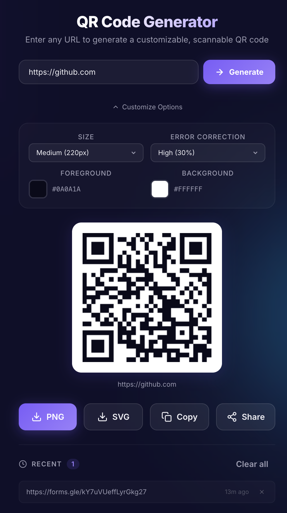

# 📱 QR Code Generator

A beautifully crafted, ridiculously fast, and 100% free QR code generator. Generate, customize, and download QR codes for your URLs instantly. No ads, no tracking, and no expiring links.

## The “Why I Built This” Story (A Real College Lesson)

Picture this: It’s our department event. The auditorium is filling up. Faculty members are on stage. Students are settling down.

One of my faculty members tells me:
"Create a Google Form and show the QR code on the projector so everyone can register quickly."

Simple task, right?

I quickly create the Google Form. Then I search for a “free QR code generator.” I try a few different websites, paste the link, download the QR code, and send it to be displayed on the presenter screen.

The QR code goes live.

Students start scanning.

Instead of opening the form instantly, some phones get redirected first. Pop-ups. Random ads. One of those loud, flashy mobile game ads. On a big screen. In a department event.

I could feel the shift in the room.

Faculty noticed. Students noticed. I was standing there knowing this happened because of the tool I chose.

It wasn’t a technical failure.
It was a judgment failure.

Those websites weren’t generating true static QR codes. They were wrapping my Google Form link inside their own tracking links. That means:

The scan first goes to their server.

They inject ads or redirects.

They control what happens before the actual form loads.

In a casual setting, maybe that’s fine.
In an academic event, it’s not.

That moment stuck with me. I realized something basic but important:

If the QR code doesn’t directly contain your actual URL, you don’t really own it.

So instead of trusting random “free” websites again, I built my own tool.

No signups.
No ads.
No tracking redirects.
No expiry tricks.

Just a simple browser-based generator that creates static QR codes containing the real link itself. Once generated, it works as long as the original link works. Nothing in between.

I didn’t build it to impress anyone.
I built it because I don’t want to risk my credibility — or my department’s — over a careless dependency.

If you’re handling events, workshops, registrations, or presentations as a student, here’s the hard truth:

Free tools aren’t always free.
Sometimes you pay with embarrassment.

I learned that the practical way.
---

##  Features

-  **Instant Generation:** Type a URL and watch the QR code appear instantly.
-  **Customization:** Change foreground and background colors to match your brand.
-  **Size Options:** From tiny (150px) to massive (400px), we've got you covered.
-  **Error Correction:** Adjust the error correction level (L, M, Q, H) to ensure scannability even if part of the code is blocked.
-  **Multiple Formats:** Download your QR code as a crisp `PNG` or scalable `SVG`.
-  **Copy to Clipboard:** One-click copy the QR image directly to your clipboard.
-  **History Panel:** Automatically saves your recently generated QR codes in your local storage so you don't lose track of them.
-  **Fully Responsive:** Looks gorgeous on desktop, tablet, and mobile.
-  **Dark Mode UI:** Because everything looks better with a sleek, glassmorphism dark theme.

##  Built With

- **HTML5:** Semantic and accessible structure.
- **Vanilla CSS3:** Modern features, custom properties (variables), Flexbox, Grid, and Glassmorphism effects.
- **Vanilla JavaScript (ES6+):** Modular file structure, event delegation, and Web APIs (Clipboard API, Web Share API, localStorage).
- **[QRCode.js](https://github.com/davidshimjs/qrcodejs):** A lightweight, reliable library for generating the actual QR codes.

##  Getting Started

Since this is a client-side only application, getting started is incredibly simple!

###  Live Demo
 **Try it here:** https://qrgenerator-v1.vercel.app

##  Contributing

Contributions, issues, and feature requests are welcome!
Feel free to check [issues page](https://github.com/richujoseph/QR_Generator/issues).

##  License

This project is [MIT](https://choosealicense.com/licenses/mit/) licensed.
